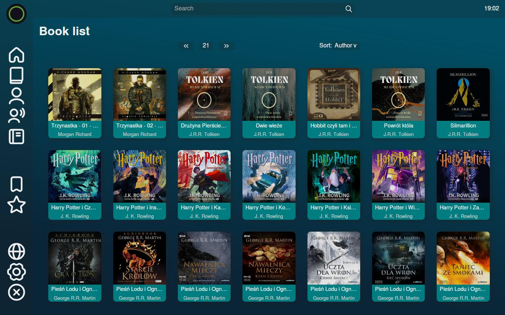

# FinalShelf

 

**FinalShelf** is the next generation of my earlier app [LibraAlchemy](https://github.com/Azalurg/LibraAlchemy). It evolves the original concept by integrating a powerful database and a custom-built user interface. Unlike the previous version, which required a server and web browser to view your audiobook collection, FinalShelf consolidates everything into a single application for seamless management and navigation.

The application is built with Rust for efficient, high-performance audiobook management and Angular Tauri for the modern, cross-platform desktop user interface.

:warning: For now only a Linux version is available. :warning:

## Features

- **Metadata Scanning**: The app scans your audiobook files using their embedded metadata, allowing you to view much more detailed information such as title, author, series, and more.
- **Built-in UI**: With a fully integrated user interface (UI), you no longer need a web browser. The app provides a beautiful and interactive environment to explore your collection.
- **Advanced Search**: You can search for books by title, author, or series, ensuring you can quickly find what you're looking for.
- **Pagination**: Effortlessly browse large libraries with pagination that prevents performance issues when navigating through thousands of audiobooks.
- **Cover Art Display**: Audiobook cover images are automatically displayed alongside each book for easier identification and a visually appealing experience.
- **Responsive UI**: The app includes a dynamic and user-friendly interface, allowing you to sort books by author or title and view the book details in a neat, organized manner.

## Todo

This section for now in Polish, app in development ;-)

### Implementacja

- filtrowanie
- przeczytane
- ranking
- ustawienia?

### Rust

- Przechowywanie lokacji w formie ścieżki względnej

### Angular

- naprawić / usprawnić wyszukiwanie (nowy design)
- fix toolbar navPaths
