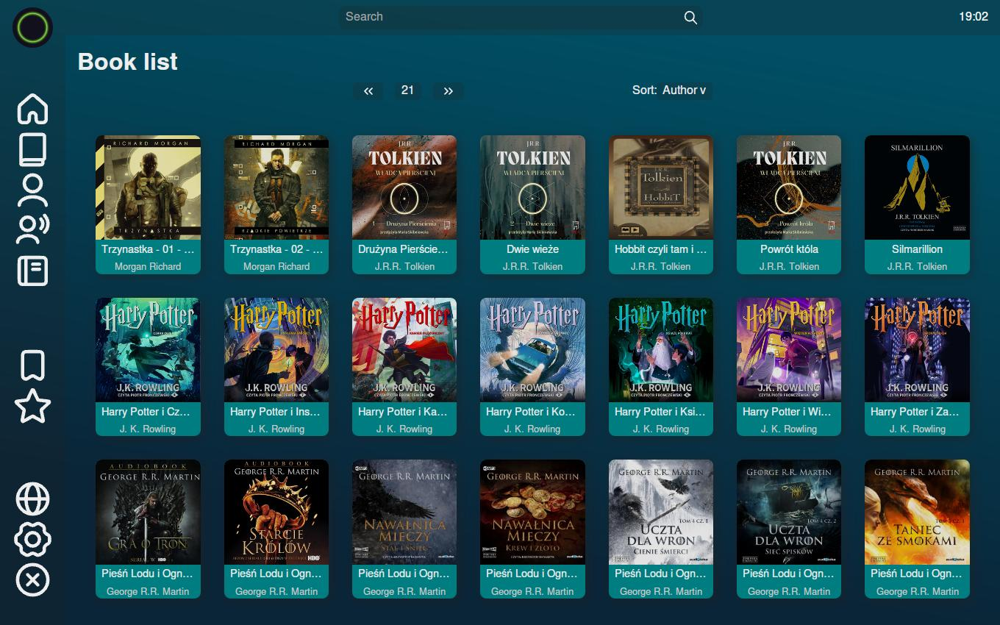
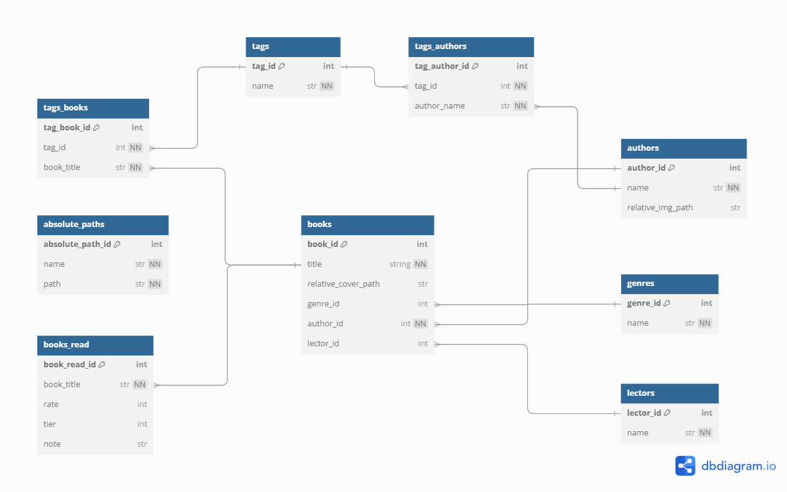

# FinalShelf

 

**FinalShelf** is the next generation of my earlier app [LibraAlchemy](https://github.com/Azalurg/LibraAlchemy). It evolves the original concept by integrating a powerful database and a custom-built user interface. Unlike the previous version, which required a server and web browser to view your audiobook collection, FinalShelf consolidates everything into a single application for seamless management and navigation.

The application is built with Rust for efficient, high-performance audiobook management and Angular Tauri for the modern, cross-platform desktop user interface.

:warning: For now only a Linux version is available. :warning:

## Features

- **Metadata Scanning**: The app scans your audiobook files using their embedded metadata, allowing you to view much more detailed information such as title, author, series, and more.
- **Built-in UI**: With a fully integrated user interface (UI), you no longer need a web browser. The app provides a beautiful and interactive environment to explore your collection.
- **Advanced Search**: You can search for books by title, author, or series, ensuring you can quickly find what you're looking for.
- **Pagination**: Effortlessly browse large libraries with pagination that prevents performance issues when navigating through thousands of audiobooks.
- **Cover Art Display**: Audiobook cover images are automatically displayed alongside each book for easier identification and a visually appealing experience.
- **Responsive UI**: The app includes a dynamic and user-friendly interface, allowing you to sort books by author or title and view the book details in a neat, organized manner.

## Development

### Data & database

    

 

This is a database diagram illustrating the relationships between various entities. The structure is designed to ensure that the tags and books read can be accurately recreated, even if the book IDs change due to a full scan of the library. Additionally, there is a configuration file, FinalShelf.json, which contains supplementary settings, such as theme preferences and other customizations.

## TODO

- dodać datę utworzenia pliku na dysku do książki
- dodać możliwość przechowywania ścieżek bezwzględnych
    - poprawić funkcję skanującą
    - dodać odpowiednie struktury do bazy danych
    - zaktualizować funkcje na froncie
- dodać paginację do serwisów
- naprawić stare widoki na froncie
- wprowadzić ład w Angular
- dodać sortowanie i filtrowanie
- dodać nowe widoki

## OldTodo

This section for now in Polish, app in development ;-)

### Implementacja

- filtrowanie
- przeczytane
- ranking
- ustawienia?

### Rust

- Przechowywanie lokacji w formie ścieżki względnej
- Dodać plik przechowujący ustawienia aplikacji

### Angular

- wyodrębnić część wyścielającą książki tak aby dało się użyć tego samego kodu dla autorów
- dodać widok listy dla książek / autorów
- naprawić / usprawnić wyszukiwanie (nowy design)
- fix toolbar navPaths
